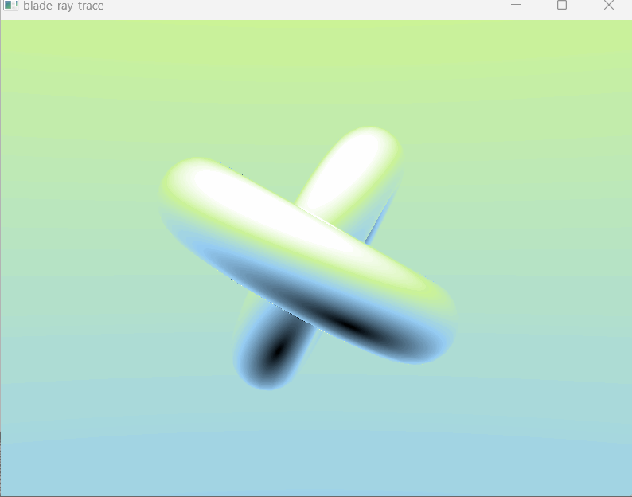
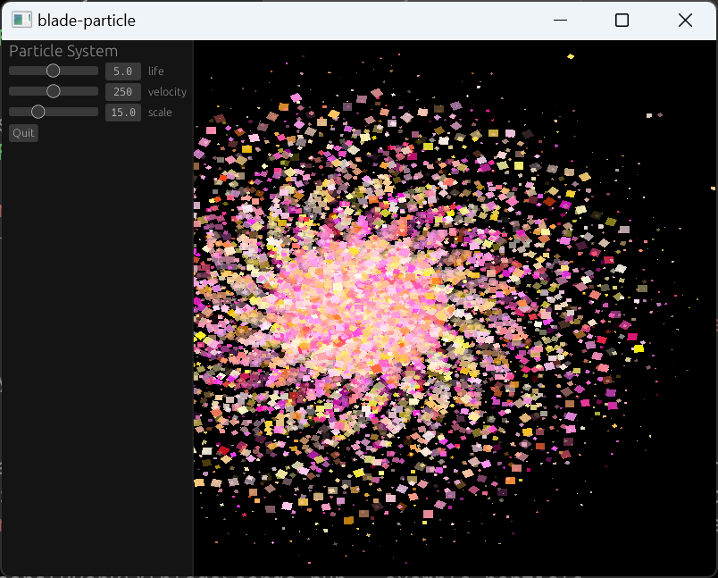

# Blade Graphics

[](https://docs.rs/blade-graphics)
[](https://crates.io/crates/blade-graphics)

Blade-graphics is a lean and mean [GPU abstraction](https://youtu.be/63dnzjw4azI?t=623) aimed at ergonomics and fun. See [motivation](etc/motivation.md), [FAQ](etc/FAQ.md), and [performance](etc/performance.md) for details.

## Examples




## Platforms

The backend is selected automatically based on the host platform:
- *Vulkan* on desktop Linux, Windows, and Android
- *Metal* on desktop macOS, and iOS
- *OpenGL ES3* on the Web

| Feature | Vulkan | Metal | GLES |
| ------- | ------ | ----- | ---- |
| compute | :white_check_mark: | :white_check_mark: | |
| ray tracing | :white_check_mark: | | |

### Vulkan

Required instance extensions:
- VK_EXT_debug_utils
- VK_KHR_get_physical_device_properties2
- VK_KHR_get_surface_capabilities2

Required device extensions:
- VK_EXT_inline_uniform_block
- VK_KHR_descriptor_update_template
- VK_KHR_timeline_semaphore
- VK_KHR_dynamic_rendering

Conceptually, Blade requires the baseline Vulkan hardware with a relatively fresh driver.
All of these required extensions are supported in software by the driver on any underlying architecture.

### OpenGL ES

GLES is also supported at a basic level. It's enabled for `wasm32-unknown-unknown` target, and can also be force-enabled on native:
```bash
RUSTFLAGS="--cfg gles" CARGO_TARGET_DIR=./target-gl cargo run --example bunnymark
```

This path can be activated on all platforms via Angle library.
For example, on macOS it's sufficient to place `libEGL.dylib` and `libGLESv2.dylib` in the working directory.

### WebGL2

Following command will start a web server offering the `bunnymark` example:
```bash
cargo run-wasm --example bunnymark
```

### Vulkan Portability

First, ensure to load the environment from the Vulkan SDK:
```bash
cd /opt/VulkanSDK && source setup-env.sh
```

Vulkan backend can be forced on using "vulkan" config flag. Example invocation that produces a vulkan (portability) build into another target folder:
```bash
RUSTFLAGS="--cfg vulkan" CARGO_TARGET_DIR=./target-vk cargo test
```
