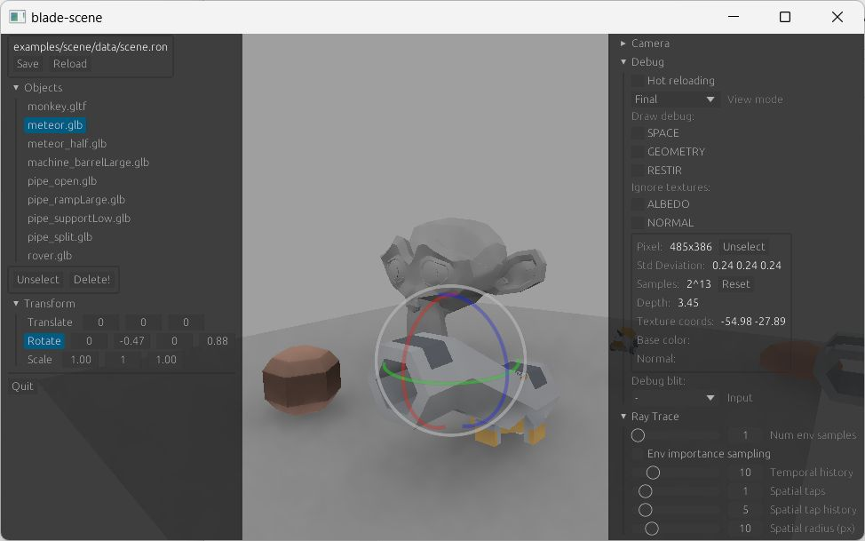

# Blade

[](https://matrix.to/#/#blade-dev:matrix.org)
[](https://github.com/kvark/blade/actions)
[](https://docs.rs/blade)
[](https://crates.io/crates/blade)


Blade is an innovative rendering solution for Rust. It starts with an ergonomic [low-level GPU abstraction](https://youtu.be/63dnzjw4azI?t=623), which is actually fun to play with. It then grows into a high-level rendering library that utilizes hardware ray-tracing. Finally, a [task-parallel asset pipeline](https://youtu.be/1DiA3OYqvqU) together with [egui](https://www.egui.rs/) support turn it into a minimal rendering engine.

See [motivation](motivation.md), [FAQ](FAQ.md), and [performance](performance.md) for more info about the low-level API.





## Instructions

Just the usual :crab: workflow. E.g. to run the bunny-mark benchmark run:
```bash
cargo run --release --example bunnymark
```

## Platforms

The backend is selected automatically based on the host platform:
- *Vulkan* on desktop Linux, Windows, and Android
- *Metal* on desktop macOS, and iOS
- *OpenGL ES3* on the Web

| Feature | Vulkan | Metal | GLES |
| ------- | ------ | ----- | ---- |
| compute | :white_check_mark: | :white_check_mark: | |
| ray tracing | :white_check_mark: | | |

### OpenGL ES

GLES is also supported at a basic level. It's enabled for `wasm32-unknown-unknown` target, and can also be force-enabled on native:
```bash
RUSTFLAGS="--cfg gles" CARGO_TARGET_DIR=./target-gl cargo test
```

This path can be activated on all platforms via Angle library.
For example, on macOS it's sufficient to place `libEGL.dylib` and `libGLESv2.dylib` in the working directory.

### WebGL2

Following command will start a web server offering the `bunnymark` example:
```bash
cargo run-wasm --example bunnymark
```

### Vulkan Portability

First, ensure to load the environment from the Vulkan SDK:
```bash
cd /opt/VulkanSDK && source setup-env.sh
```

Vulkan backend can be forced on using "vulkan" config flag. Example invocation that produces a vulkan (portability) build into another target folder:
```bash
RUSTFLAGS="--cfg vulkan" CARGO_TARGET_DIR=./target-vk cargo test
```
