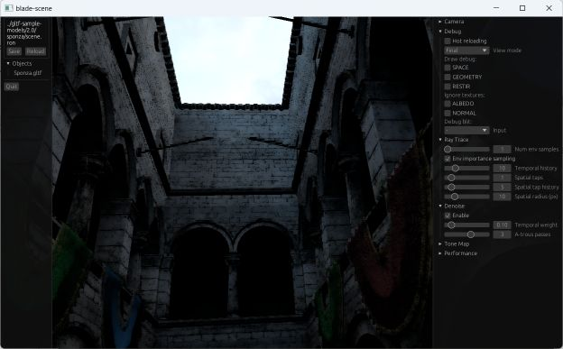
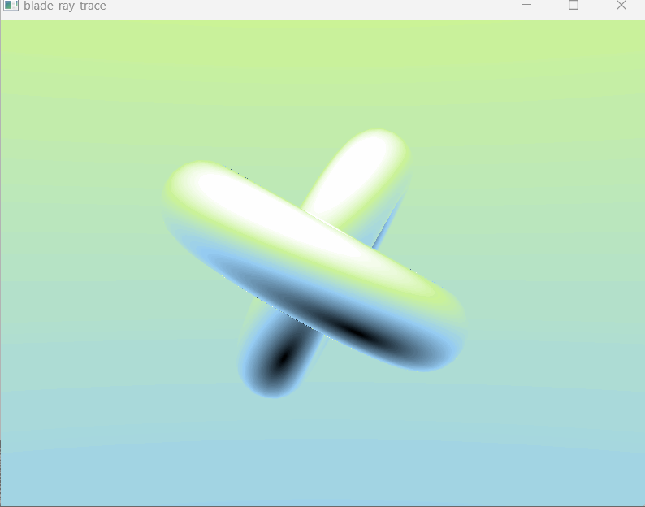

# Blade

[](https://matrix.to/#/#blade-dev:matrix.org)
[](https://github.com/kvark/blade/actions)
[](https://docs.rs/blade)
[](https://crates.io/crates/blade)


Blade is a low-level GPU library in Rust with the focus on ergonomics.
It's unsafe, it's incomprehensive, but it's small, fast, and actually fun to prototype with!

See [motivation](motivation.md), [FAQ](FAQ.md), and [performance](performance.md) for more info.





## Platforms

The backend is selected automatically based on the host platform.

Vulkan:
- Desktop Linux/Windows
- Android

Metal:
- Desktop macOS
- iOS

OpenGL ES:
- Web

## Instructions

Check:
```
cargo check
```
Run the minimal example:
```
cargo run --example mini
```

### OpenGL ES

GLES is also supported at a basic level. It's enabled for `wasm32-unknown-unknown` target, and can also be force-enabled on native:
```bash
RUSTFLAGS="--cfg gles" CARGO_TARGET_DIR=./target-gl cargo test
```

This path can be activated on all platforms via Angle library.
For example, on macOS it's sufficient to place `libEGL.dylib` and `libGLESv2.dylib` in the working directory.

### WebGL2

Following command will start a web server offering the `bunnymark` example:
```bash
cargo run-wasm --example bunnymark
```

### Vulkan Portability

First, ensure to load the environment from the Vulkan SDK:
```bash
cd /opt/VulkanSDK && source setup-env.sh
```

Vulkan backend can be forced on using "vulkan" config flag. Example invocation that produces a vulkan (portability) build into another target folder:
```bash
RUSTFLAGS="--cfg vulkan" CARGO_TARGET_DIR=./target-vk cargo test
```

## Features

| Feature | Vulkan | Metal | GLES |
| ------- | ------ | ----- | ---- |
| compute | :white_check_mark: | :white_check_mark: | |
| ray tracing | :white_check_mark: | | |
