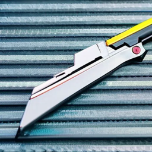
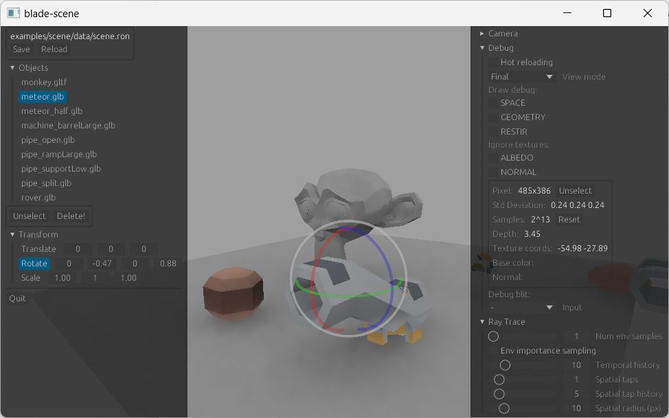
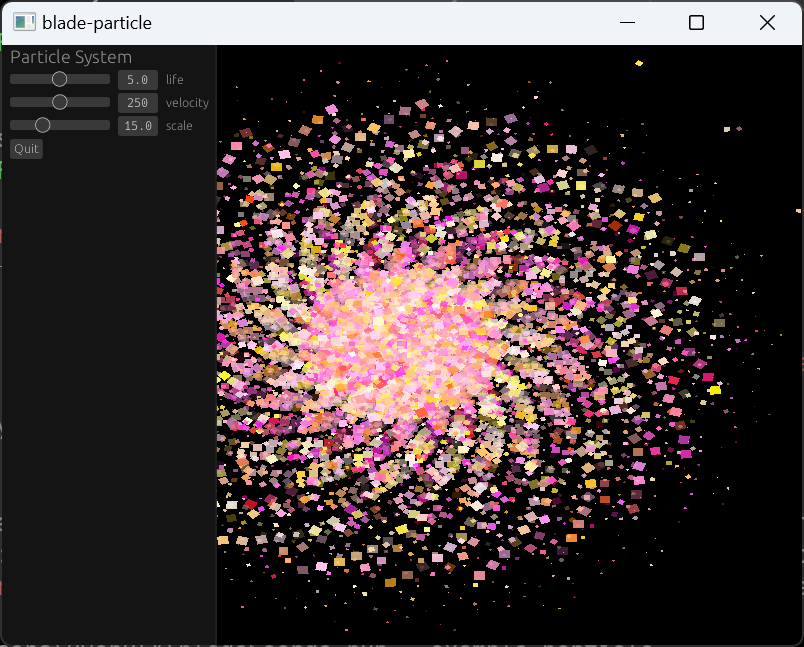
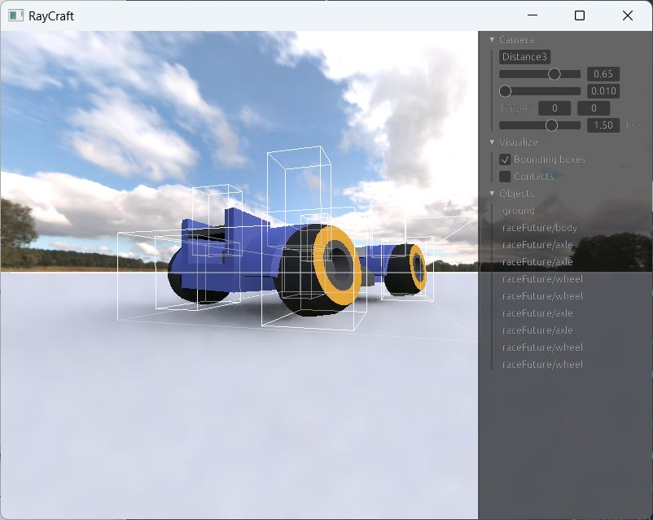
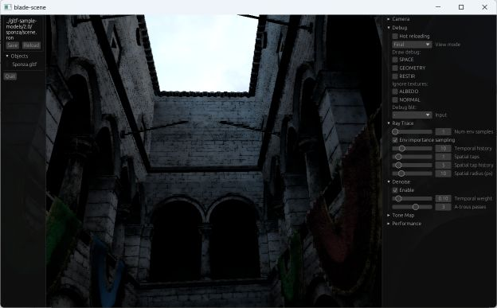

# Blade

[](https://matrix.to/#/#blade-dev:matrix.org)
[](https://github.com/kvark/blade/actions)
[](https://docs.rs/blade)
[](https://arxiv.org/abs/2607.26506)

[](https://crates.io/crates/blade-graphics)
[](https://crates.io/crates/blade-particle)
[](https://crates.io/crates/blade-render)
[](https://crates.io/crates/blade-engine)




Blade is an innovative rendering solution for Rust. It starts with a lean low-level GPU abstraction focused at ergonomics and fun. It then grows into a high-level rendering library that utilizes hardware ray-tracing. It's accompanied by a [task-parallel asset pipeline](https://youtu.be/1DiA3OYqvqU) together with [egui](https://www.egui.rs/) support, turning into a minimal rendering engine. Finally, the top-level Blade engine combines all of this with Rapier3D-based physics and hides them behind a concise API. Talks:
- [In GPU we Rust](https://youtu.be/92mwRCXvMVk) (Rust AI meetup, 2024)
- [Blade - lean and mean graphics library](https://youtu.be/63dnzjw4azI?t=623) (Rust Graphics meetup, 2023)
- [Blade asset pipeline](https://youtu.be/1DiA3OYqvqU) (Rust Gamedev meetup, 2023)
- [Blade scene editor](https://www.youtube.com/watch?v=Q5IUOvuXoC8) (Rust Gamedev meetup, 2023)


## Examples






## Instructions

Just the usual :crab: workflow. E.g. to run the bunny-mark benchmark run:

```bash
cargo run --release --example bunnymark
```

CPU tests run with the default command:

```bash
cargo test
```

GPU integration tests are marked `#[ignore]` and need to be requested explicitly:

```bash
cargo test --test gpu_examples -- --ignored --nocapture
```

## Platforms

Blade-graphics can run on:
- Linux (Vulkan and GLES)
- Windows (Vulkan)
- iOS/MacOS/tvOS (Metal)
- Android (OpenXR/Vulkan)
- Web (WebGL2)

The full-stack Blade Engine supports its rasterizer on WebGL2. The ray-traced
renderer remains available only on backends and devices with ray-query support.

## Research

[Global Pass Barriers Without Per-Resource RHI Tracking: A Cross-Vendor Study
with Blade](https://arxiv.org/abs/2607.26506) measures Blade's synchronization
model against matched wgpu workloads on AMD, NVIDIA, Intel, and Apple hardware.
A [repository copy](global-pass-barriers.pdf) is retained with the code. The
[synchronization guide](synchronization.md) summarizes the resulting design and
what an engine using Blade is still responsible for.
