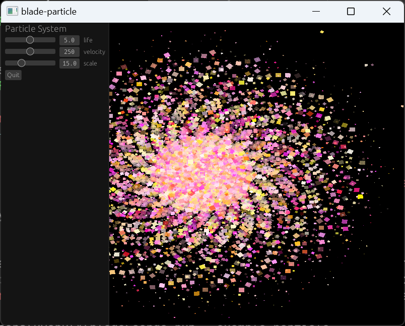

# Blade

[](https://matrix.to/#/#blade-dev:matrix.org)
[](https://github.com/kvark/blade/actions)
[](https://docs.rs/blade)
[](https://crates.io/crates/blade)
[](https://crates.io/crates/blade-graphics)
[](https://crates.io/crates/blade-render)


Blade is an innovative rendering solution for Rust. It starts with a lean [low-level GPU abstraction](https://youtu.be/63dnzjw4azI?t=623) focused at ergonomics and fun. It then grows into a high-level rendering library that utilizes hardware ray-tracing. Finally, a [task-parallel asset pipeline](https://youtu.be/1DiA3OYqvqU) together with [egui](https://www.egui.rs/) support turn it into a minimal rendering engine.


## Examples





## Instructions

Just the usual :crab: workflow. E.g. to run the bunny-mark benchmark run:
```bash
cargo run --release --example bunnymark
```

## Platforms

The full-stack Blade Engine can only run on Vulkan with hardware Ray Tracing support.
However, on secondary platforms, such as Metal and GLES/WebGL2, one can still use Blde-Graphics and Blade-Egui.
